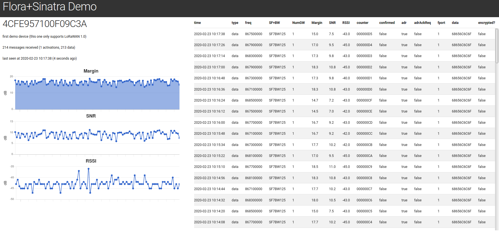

Sinatra Based Demo
==================

This demo shows how to integrate [Flora](https://github.com/cjhdev/flora) 
with Sinatra and Sequel.

- Sqlite initialised with device records
- Redis is "warmed" on startup with devices from Sqlite
    - if Redis state has previously been exported it is restored
- demo saves events against Sqlite device records
    - activations
    - upstream data
    - updated Redis state
- demo displays table of last 100 data and activation events with a plot
  for margin, SNR, and RSSI

## Installation and Configuration

### Ruby

Ensure modern-ish Ruby and Bundle are installed. Use Bundle to install
Ruby dependencies:

~~~
bundle install
~~~

### Add Devices to Database

There is no GUI for managing devices, instead they are seeded by a rake
task from the [devices.yaml](devices.yaml) file. Use the existing 
records as a guide for the required format.
    
Once you have entered your device information into the device files, use 
this command to create and setup the Sqlite db:

~~~
bundle exec rake db:reset
~~~

Note that this command can be used at anytime to reset the demo state.

### Configure Application Ports

You may need to change the hostname and ports used by the demo. They
are accessible in the SETTINGS hash at the top of [environment.rb](environment.rb):

- gateway_port: default is 1700; gateway sends upstream to this port
- gateway_host: default binds to all interfaces on localhost
- app_port: default is 4567; point your browser to this port
- app_host: default is localhost

### Configuring LoRa Gateway

This part of the demo assumes you have a LoRa gateway which:

- implements the "Semtech UDP Packet Forwarder" format
- accepts [this](default_eu.json) SX1301 style configuration file 

The configuration provided will work with the "default_eu" channel plan, and should
only be used in that part of the world. Change the following fields:

- gateway_conf.serv_port_up: the Flora listen port (UDP)
- gateway_conf.serv_port_down: the gateway port used for holepunching (UDP)
- gateway_conf.server_address: point to the host running Flora
- gateway_conf.gateway_ID: the EUI of your gateway

### Resetting Demo State

~~~
bundle exec rake db:reset
~~~

## Run the Demo

Once installation and configuration is complete you can run the demo.

~~~
bundle exec ruby demo.rb
~~~

As the demo runs it will print logs to the terminal. You will see both
Flora messages as well as the more familiar Sinatra messages.

To view the UI point your browser to "<app_host>:<app_port>".

Thanks to export caching it should be possible to start/stop the demo
without needing to rejoin devices.
