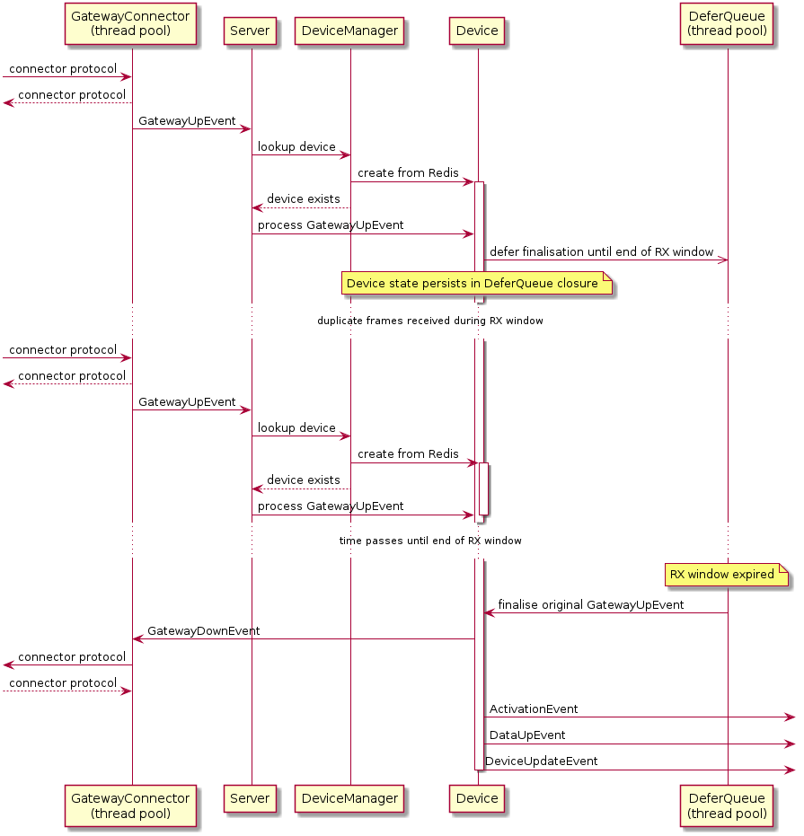

Flora: A Composable LoRaWAN Network Server
==========================================

Flora is a [LoRaWAN](https://en.wikipedia.org/wiki/LoRa#LoRaWAN) 
Network Server written in Ruby.

Compared to [other](#see-also) Network Server projects, Flora:

- is far less mature and has fewer features
- is composable rather than standalone (i.e. it must be integrated into a Ruby program)
- doesn't implement a UI
- doesn't implement application interfaces (e.g. it doesn't fire webhooks or force you to use protobufs)

Flora is useful in situations where you want a scriptable Network Server 
without a bunch of other stuff. Flora currently depends on:

- [nio4r](https://github.com/socketry/nio4r) (for reactor pattern sockets)
- [websocket-driver](https://github.com/faye/websocket-driver-ruby) (for LNS gateway protocol)
- redis (or [FakeRedis](https://github.com/guilleiguaran/fakeredis))

## Features

- class A
- OTAA
- gateway to server protocol    
    - ["Semtech UDP Packet Forwarder" format](https://github.com/Lora-net/packet_forwarder)
    - [LNS format](https://doc.sm.tc/station/tcproto.html) (recommended)
- LoRaWAN 1.1 support
    - key derivation etc.
    - Rekey command handling
- plug-and-play channel plans
    - devices are configured at join time according to the capability of the joining gateway
- ADR (as per LoRa Networks Rate Adaption document)
- mac command handling
    - LinkCheckReq/Ans
    - RekeyInd/Conf
    - DeviceTimeReq/Ans
    - LinkADRReq/Ans  
- end-to-end data privacy (LoRaWAN 1.1 mode only)

## Limitations

There are many since Flora is a work in progress.

- no support for class B and C
- no support for ABP
- no support for rejoin
- retry confirmed data frames not handled correctly (server will drop duplicates)
- no feature for scheduling server to do device management stuff

The list goes on. Planned improvements are in [todo.md](todo.md).
        
## Usage

Flora is a work in progress so using Bundle to install from the git
repo is recommended. Add the following to your Gemfile:

~~~ ruby
gem "flora", git: "https://github.com/cjhdev/flora"
~~~

Flora can then be integrated into an application like this:

~~~ ruby
require 'flora'
require 'fakeredis'
require 'logger'

server = Flora::Server.create do

  redis Redis.new

  gateway_connector :lns
  
  logger Logger.new(STDOUT)
  
  # events for the application appear here
  on_event do |ev, server|
  
    case ev
    when Flora::DataUpEvent           
    when Flora::ActivationEvent    
    when Flora::DeviceUpdateEvent
    end
       
  end
  
  # optionally handle eui lookups that fail (during joining)
  on_eui_missing do |ev, server|    
  end
  
  # optionally handle dev_addr lookups that fail (during session)
  on_dev_addr_missing do |ev, server|  
  end
  
end

# gateways must be registered
server.create_gateway(
    eui: ("\x01" * 8),
    config: "sx1301_eu868_1",
    auth_token: "hello world"
)

eui_for_your_device = ("\x02" * 8)

# create a fresh 1.0 device
server.create_device(
    dev_eui: eui_for_your_device,
    nwk_key: ("\x00" * 16),
    region: 'EU_863_870',
    minor: 0
)

# export a device record in format expected by #restore device
exported_record = server.export_device(eui_for_your_device)

# restore a previously exported device record
server.restore_device(exported_record)

server.start

begin
  sleep
rescue Interrupt
end

server.stop
~~~

Try out these worked examples:

- [runnable version of the usage example](examples/stdout)
- [Sinatra and Sequel integration](examples/sinatra)

## Use Cases

### Device Testing

Flora was originally developed to test LoRaWAN devices.

- A Flora test instance can run in a single process without a database
- Does not depend on services like MQTT
- There are no scattered configuration files
- No need to use containers
- Everything can be scripted

### Personal or Demo Networks

Flora (in time) will work fine for managing small numbers of devices.
        
### Rapid Prototyping

Flora is easy to integrate with Rails/Sinatra as shown in this
[example](examples/sinatra).

## How it Works

Duplicate messages are expected if a LoRaWAN device is within range of 
multiple gateways. It is desirable for a LoRaWAN Network Server to receive
all duplicates in order to work out which gateway should be used if a 
response message is to be sent back to the device.

With that in mind, the simplified diagram below shows the flow of 
receiving an original frame, receiving duplicates, and finalisation 
of the original frame:

## See Also

- [LDL](https://github.com/cjhdev/lora_device_lib) (Device implementation)
- [ChirpStack](https://www.chirpstack.io/) (Server implementation)
- [The Things Network](https://github.com/TheThingsNetwork) (Server implementation)
- [lorawan-server](https://github.com/gotthardp/lorawan-server) (Server implementation)

## License

MIT
